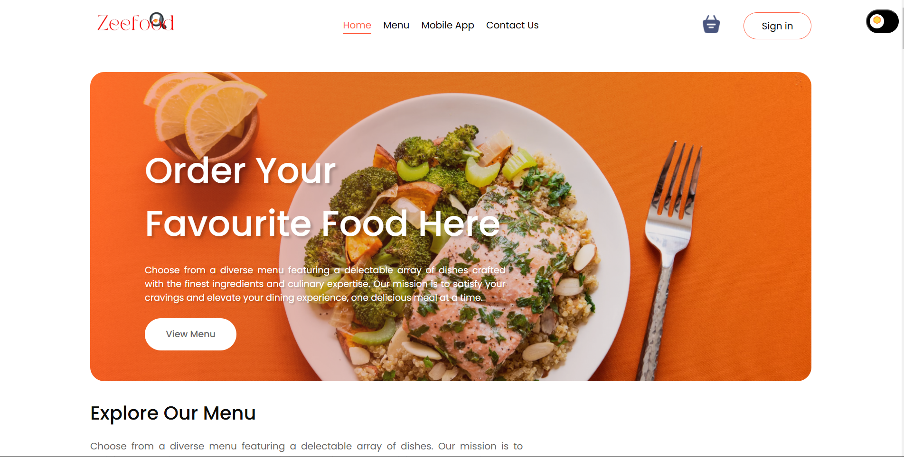

#Food Delivery System
A responsive and user-friendly food delivery platform built with ReactJS and CSS. This application allows users to browse through a menu, add items to a cart, and place orders seamlessly.

#Project Description
The Food Delivery System provides an intuitive and visually appealing platform for users to explore menu items, manage their cart, and place orders. The focus is on delivering an engaging user experience with responsive design and dynamic functionality.

#Key Features
Browse Menu: Explore a variety of food items with images and descriptions.
Search Functionality: Quickly find specific dishes using the search bar.
Cart Management: Add, remove, and adjust quantities of items in the cart.
Responsive Design: Optimized for desktops, tablets, and mobile devices.
Dynamic Pricing: Real-time calculation of total prices based on cart items.
Setup Instructions
Prerequisites
Ensure you have the following installed on your system:

Node.js (version 14 or higher)
npm (comes with Node.js) or yarn
Installation Steps
Clone the repository:

bash
Copy code
git clone https://github.com/your-username/food-delivery-system.git
Navigate to the project directory:

bash
Copy code
cd food-delivery-system
Install the required dependencies:

bash
Copy code
npm install
Start the development server:

bash
Copy code
npm start
Open the application in your browser
http://localhost:3000
Challenges and Limitations
Challenges Faced:
State Management: Managing the cart items dynamically required careful handling of React state.
CSS Styling: Ensuring consistent and responsive design across all screen sizes.
Limitations:
No Backend Integration: Currently, the app does not store user data or persist orders.
Limited Features: Future updates may include user authentication and order tracking.
Assumptions
The user has a stable internet connection to load images and assets.
Menu items are hardcoded or fetched from a local mock API.
Technologies Used
Frontend: ReactJS
Styling: CSS (Plain CSS without frameworks)
State Management: React hooks (useState, useContext)
Routing: React Router
Future Improvements
Backend Integration: Implement a server-side backend for order processing and user data storage.
Authentication: Add user login/signup functionality for personalized experiences.
Payment Gateway: Enable online payments through secure payment integration.
Order Tracking: Allow users to track their orders in real-time.

